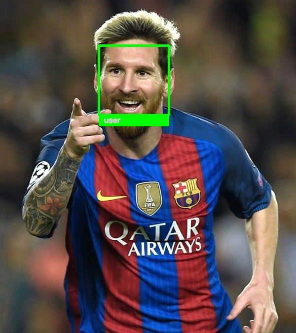

# Face Recognition Web App
## About:
Web application that uses face recognition. The web app asks the user to provide five images which 'face.py' will use to recognize the user. After that the user 
will provide another image that will be used as the test image. Then it will do some processing and will try to recognize the user and output the result. 

- python 3.6
- HTML
- flask
- opencv-python
- face_recognition

## Example:

Let's assume Messi enters the website and decides to test what it does. 

So, he uploads five images of himself. One of them might look like this:

Then he decides to use this test image:

Finally, after some processing the web app outputs the following image:

